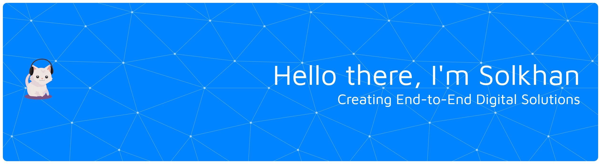

  

  I am a <strong>Fullstack Web Developer</strong> and an Informatics student at Diponegoro University with a passion for building end-to-end digital solutions. My focus is on writing clean, efficient, and secure code. Welcome to the central hub for my coding projects and learning journey!

  
  &nbsp;
  
  &nbsp;
  

  
  <strong>My Learning Journey & Core Competencies</strong>

 

  

    I am committed to continuous learning through a structured path on platforms like <strong>KelasFullstack</strong>, <strong>Udemy</strong>, and other online resources.  This journey covers the entire spectrum of modern web development.
  

  <table style="border: none; width:100%; max-width: 800px; border-collapse: collapse;">
    <tr align="center">
      <td valign="top" width="50%" style="padding: 10px; border-bottom: 1px solid #444; border-right: 1px solid #444;">
        

          <strong>  Fundamentals</strong>
        

        

          Algorithms & Data Structures 
          Git & Version Control 
          CLI / Terminal
        

      </td>
      <td valign="top" width="50%" style="padding: 10px; border-bottom: 1px solid #444;">
        

          <strong>  Frontend Development</strong>
        

        

          HTML, CSS, JavaScript (ES6+) 
          React.js, Vue.js, Next.js 
          TailwindCSS, Bootstrap
        

      </td>
    </tr>
    <tr align="center">
      <td valign="top" width="50%" style="padding: 10px; border-right: 1px solid #444;">
        

          <strong>  Deployment & DevOps</strong>
        

        

          Linux, NGINX, VPS Setup 
          Docker, cPanel 
          Vercel, Netlify
        

      </td>
      <td valign="top" width="50%" style="padding: 10px;">
        

          <strong>  Additional Skills</strong>
        

        

          UI/UX Design Principles 
          Software Testing (Selenium) 
          Career Development
        

      </td>
    </tr>
    <tr align="center">
      <td valign="top" colspan="2" style="padding: 10px; border-top: 1px solid #444;">
        

          <strong>  Backend Development</strong>
        

        

          PHP (OOP), Laravel, CodeIgniter 
          Node.js, Express.js, NestJS 
          MySQL, PostgreSQL, MongoDB
        

      </td>
    </tr>
  </table>

 

<h3 align="center">🛠️ Tech Stack & Tools</h3>

  <a href="https://skillicons.dev">
    
     
    
     
    
  </a>

<h3 align="center">📈 GitHub Activity & Stats</h3>

  
  

  

<h3 align="center">🌐 Other Platforms & Activity</h3>

  
  &nbsp;
  
  &nbsp;
  

  
 &nbsp;&nbsp;
  

